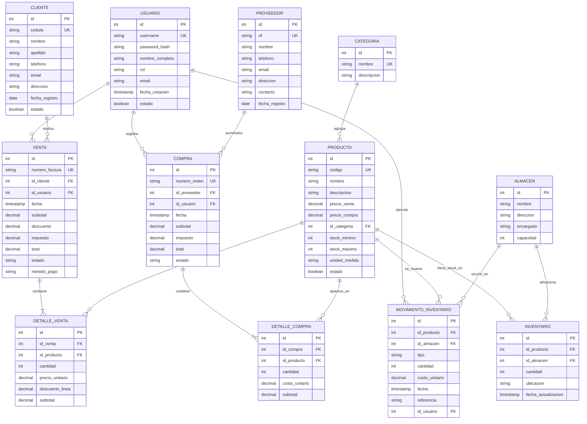

# Modelo Entidad-Relación

> Documento que describe el modelo conceptual y lógico de la base de datos del Sistema Administrativo de Ventas, Inventario y Almacén.

**Materia:** Programación I - Módulo 2 (UNETI)
**Estudiante:** Daniel Díaz
**Profesor:** Rodolfo Caccamo
**Motor de BD:** PostgreSQL

---

## 1. Visión General

El modelo se compone de **12 entidades** interconectadas, que cubren los tres ejes funcionales del sistema:

- **Eje comercial** → Cliente, Venta, Detalle de Venta, Usuario
- **Eje de catálogo** → Categoría, Producto, Proveedor, Compra, Detalle de Compra
- **Eje logístico** → Almacén, Inventario, Movimiento de Inventario

Todas las entidades comparten una clave primaria sustituta (`id SERIAL`) para mantener uniformidad y evitar dependencias de claves naturales que pueden cambiar (cédulas, RIF, códigos).

---

## 2. Diagrama Entidad-Relación

> **Nota:** Mermaid renderiza el diagrama automáticamente en GitHub, GitLab y la mayoría de visores Markdown modernos (VS Code con extensión Mermaid Preview).

---

## 3. Descripción de Entidades

### 3.1 USUARIO
Empleado del sistema con permisos para registrar operaciones (ventas, compras, movimientos).

| Campo | Tipo | Restricción | Descripción |
|---|---|---|---|
| id | SERIAL | PK | Identificador único |
| username | VARCHAR(50) | UNIQUE, NOT NULL | Nombre de usuario para login |
| password_hash | VARCHAR(255) | NOT NULL | Contraseña encriptada |
| nombre_completo | VARCHAR(150) | NOT NULL | Nombre real del empleado |
| rol | VARCHAR(30) | NOT NULL | Admin, Vendedor, Almacenista |
| email | VARCHAR(100) | UNIQUE | Correo del usuario |
| fecha_creacion | TIMESTAMP | DEFAULT NOW() | Fecha de alta |
| estado | BOOLEAN | DEFAULT TRUE | Activo / Inactivo |

### 3.2 CLIENTE
Persona o empresa que adquiere productos.

| Campo | Tipo | Restricción | Descripción |
|---|---|---|---|
| id | SERIAL | PK | Identificador único |
| cedula | VARCHAR(20) | UNIQUE, NOT NULL | Cédula o documento de identidad |
| nombre | VARCHAR(100) | NOT NULL | Nombre |
| apellido | VARCHAR(100) | | Apellido |
| telefono | VARCHAR(20) | | Teléfono de contacto |
| email | VARCHAR(100) | | Correo electrónico |
| direccion | TEXT | | Dirección física |
| fecha_registro | DATE | DEFAULT CURRENT_DATE | Fecha de alta |
| estado | BOOLEAN | DEFAULT TRUE | Activo / Inactivo |

### 3.3 PROVEEDOR
Empresa que suministra productos al negocio.

| Campo | Tipo | Restricción | Descripción |
|---|---|---|---|
| id | SERIAL | PK | Identificador único |
| rif | VARCHAR(20) | UNIQUE, NOT NULL | RIF / NIT del proveedor |
| nombre | VARCHAR(150) | NOT NULL | Razón social |
| telefono | VARCHAR(20) | | Teléfono |
| email | VARCHAR(100) | | Correo |
| direccion | TEXT | | Dirección |
| contacto | VARCHAR(100) | | Persona de contacto |
| fecha_registro | DATE | DEFAULT CURRENT_DATE | Fecha de alta |

### 3.4 CATEGORIA
Clasificación general de los productos.

| Campo | Tipo | Restricción | Descripción |
|---|---|---|---|
| id | SERIAL | PK | Identificador único |
| nombre | VARCHAR(80) | UNIQUE, NOT NULL | Nombre de la categoría |
| descripcion | TEXT | | Descripción detallada |

### 3.5 PRODUCTO
Artículo comercializado por la empresa.

| Campo | Tipo | Restricción | Descripción |
|---|---|---|---|
| id | SERIAL | PK | Identificador único |
| codigo | VARCHAR(30) | UNIQUE, NOT NULL | SKU / código interno |
| nombre | VARCHAR(150) | NOT NULL | Nombre del producto |
| descripcion | TEXT | | Detalle del producto |
| precio_venta | DECIMAL(10,2) | NOT NULL CHECK (>=0) | Precio al público |
| precio_compra | DECIMAL(10,2) | CHECK (>=0) | Costo de adquisición |
| id_categoria | INT | FK → CATEGORIA(id) | Categoría a la que pertenece |
| stock_minimo | INT | DEFAULT 0 | Umbral de alerta |
| stock_maximo | INT | | Capacidad máxima |
| unidad_medida | VARCHAR(20) | | Unidad, kg, litro, caja |
| estado | BOOLEAN | DEFAULT TRUE | Activo / Inactivo |

### 3.6 ALMACEN
Ubicación física donde se guarda el stock.

| Campo | Tipo | Restricción | Descripción |
|---|---|---|---|
| id | SERIAL | PK | Identificador único |
| nombre | VARCHAR(80) | NOT NULL | Nombre del almacén |
| direccion | TEXT | | Dirección física |
| encargado | VARCHAR(100) | | Responsable |
| capacidad | INT | | Capacidad total |

### 3.7 INVENTARIO
Stock disponible de cada producto en cada almacén (relación N:M resuelta).

| Campo | Tipo | Restricción | Descripción |
|---|---|---|---|
| id | SERIAL | PK | Identificador único |
| id_producto | INT | FK → PRODUCTO(id), NOT NULL | Producto |
| id_almacen | INT | FK → ALMACEN(id), NOT NULL | Almacén |
| cantidad | INT | NOT NULL CHECK (>=0) | Stock actual |
| ubicacion | VARCHAR(50) | | Pasillo / estante |
| fecha_actualizacion | TIMESTAMP | DEFAULT NOW() | Última actualización |

> **UNIQUE (id_producto, id_almacen)** — un producto sólo puede tener un registro de stock por almacén.

### 3.8 VENTA
Cabecera de la transacción comercial.

| Campo | Tipo | Restricción | Descripción |
|---|---|---|---|
| id | SERIAL | PK | Identificador único |
| numero_factura | VARCHAR(20) | UNIQUE, NOT NULL | Número correlativo |
| id_cliente | INT | FK → CLIENTE(id), NOT NULL | Cliente comprador |
| id_usuario | INT | FK → USUARIO(id), NOT NULL | Vendedor que registra |
| fecha | TIMESTAMP | DEFAULT NOW() | Fecha y hora |
| subtotal | DECIMAL(12,2) | NOT NULL | Suma de líneas |
| descuento | DECIMAL(12,2) | DEFAULT 0 | Descuento aplicado |
| impuesto | DECIMAL(12,2) | DEFAULT 0 | IVA u otro |
| total | DECIMAL(12,2) | NOT NULL | Monto final a pagar |
| estado | VARCHAR(20) | DEFAULT 'pagada' | pagada, anulada, pendiente |
| metodo_pago | VARCHAR(30) | | Efectivo, tarjeta, transferencia |

### 3.9 DETALLE_VENTA
Líneas de cada venta (un producto por línea).

| Campo | Tipo | Restricción | Descripción |
|---|---|---|---|
| id | SERIAL | PK | Identificador único |
| id_venta | INT | FK → VENTA(id), NOT NULL | Venta a la que pertenece |
| id_producto | INT | FK → PRODUCTO(id), NOT NULL | Producto vendido |
| cantidad | INT | NOT NULL CHECK (>0) | Unidades vendidas |
| precio_unitario | DECIMAL(10,2) | NOT NULL | Precio al momento de la venta |
| descuento_linea | DECIMAL(10,2) | DEFAULT 0 | Descuento de la línea |
| subtotal | DECIMAL(12,2) | NOT NULL | cantidad × precio − descuento |

### 3.10 COMPRA
Cabecera de la orden de compra a un proveedor.

| Campo | Tipo | Restricción | Descripción |
|---|---|---|---|
| id | SERIAL | PK | Identificador único |
| numero_orden | VARCHAR(20) | UNIQUE, NOT NULL | Número de la orden |
| id_proveedor | INT | FK → PROVEEDOR(id), NOT NULL | Proveedor |
| id_usuario | INT | FK → USUARIO(id), NOT NULL | Quien la registra |
| fecha | TIMESTAMP | DEFAULT NOW() | Fecha y hora |
| subtotal | DECIMAL(12,2) | NOT NULL | Suma de líneas |
| impuesto | DECIMAL(12,2) | DEFAULT 0 | Impuestos |
| total | DECIMAL(12,2) | NOT NULL | Monto total |
| estado | VARCHAR(20) | DEFAULT 'recibida' | recibida, pendiente, anulada |

### 3.11 DETALLE_COMPRA
Líneas de cada compra.

| Campo | Tipo | Restricción | Descripción |
|---|---|---|---|
| id | SERIAL | PK | Identificador único |
| id_compra | INT | FK → COMPRA(id), NOT NULL | Compra a la que pertenece |
| id_producto | INT | FK → PRODUCTO(id), NOT NULL | Producto comprado |
| cantidad | INT | NOT NULL CHECK (>0) | Unidades compradas |
| costo_unitario | DECIMAL(10,2) | NOT NULL | Costo unitario al momento |
| subtotal | DECIMAL(12,2) | NOT NULL | cantidad × costo |

### 3.12 MOVIMIENTO_INVENTARIO
Kardex: registro histórico de cada movimiento de stock.

| Campo | Tipo | Restricción | Descripción |
|---|---|---|---|
| id | SERIAL | PK | Identificador único |
| id_producto | INT | FK → PRODUCTO(id), NOT NULL | Producto afectado |
| id_almacen | INT | FK → ALMACEN(id), NOT NULL | Almacén afectado |
| tipo | VARCHAR(20) | NOT NULL | entrada, salida, ajuste |
| cantidad | INT | NOT NULL | Unidades movidas |
| costo_unitario | DECIMAL(10,2) | | Costo en el momento (para PEPS/UEPS/Promedio) |
| fecha | TIMESTAMP | DEFAULT NOW() | Fecha del movimiento |
| referencia | VARCHAR(50) | | Ej: "VENTA-0123" o "COMPRA-0045" |
| id_usuario | INT | FK → USUARIO(id), NOT NULL | Quien lo ejecuta |

---

## 4. Justificación de las Relaciones

| # | Relación | Cardinalidad | Justificación |
|---|---|---|---|
| 1 | CLIENTE → VENTA | 1 : N | Un cliente puede realizar muchas ventas; cada venta corresponde a un único cliente. |
| 2 | VENTA → DETALLE_VENTA | 1 : N (obligatoria) | Toda venta tiene al menos una línea de detalle. Separar cabecera de líneas permite ventas multi-producto. |
| 3 | PRODUCTO → DETALLE_VENTA | 1 : N | Un producto puede aparecer en muchas líneas de venta a lo largo del tiempo. |
| 4 | PROVEEDOR → COMPRA | 1 : N | Un proveedor puede recibir muchas órdenes de compra; cada orden tiene un único proveedor. |
| 5 | COMPRA → DETALLE_COMPRA | 1 : N (obligatoria) | Toda compra tiene al menos una línea. Misma lógica que las ventas. |
| 6 | PRODUCTO → DETALLE_COMPRA | 1 : N | Un producto puede aparecer en muchas órdenes de compra. |
| 7 | CATEGORIA → PRODUCTO | 1 : N | Una categoría agrupa muchos productos; cada producto pertenece a una sola categoría. |
| 8 | PRODUCTO ↔ ALMACEN | N : M (resuelta con INVENTARIO) | Un producto puede estar en varios almacenes y un almacén guarda muchos productos. La tabla INVENTARIO resuelve esta relación con el atributo `cantidad`. |
| 9 | PRODUCTO → MOVIMIENTO_INVENTARIO | 1 : N | Cada producto genera muchos movimientos de stock a lo largo del tiempo. |
| 10 | ALMACEN → MOVIMIENTO_INVENTARIO | 1 : N | Cada almacén registra muchos movimientos. |
| 11 | USUARIO → VENTA / COMPRA / MOVIMIENTO | 1 : N | El usuario que ejecuta la operación queda registrado en cada documento (auditoría). |

---

## 5. Reglas de Negocio Reflejadas en el Modelo

1. **Toda venta y compra requiere un usuario autenticado** → integridad de auditoría.
2. **El stock no puede ser negativo** → `CHECK (cantidad >= 0)` en INVENTARIO.
3. **Los precios y costos no pueden ser negativos** → `CHECK (precio >= 0)`.
4. **Cada movimiento de stock guarda el costo unitario** → permite calcular valuación PEPS/UEPS/Promedio.
5. **Los datos históricos no se borran** → claves foráneas con `ON DELETE RESTRICT`.
6. **Productos y clientes pueden desactivarse** (no eliminarse) → campo `estado BOOLEAN`.

---

## 6. Próximo Paso

Convertir este modelo lógico al **script SQL** de creación de tablas (`database/schema.sql`), incluyendo todas las restricciones (PK, FK, UNIQUE, CHECK, DEFAULT) y los índices recomendados para optimizar consultas frecuentes.
